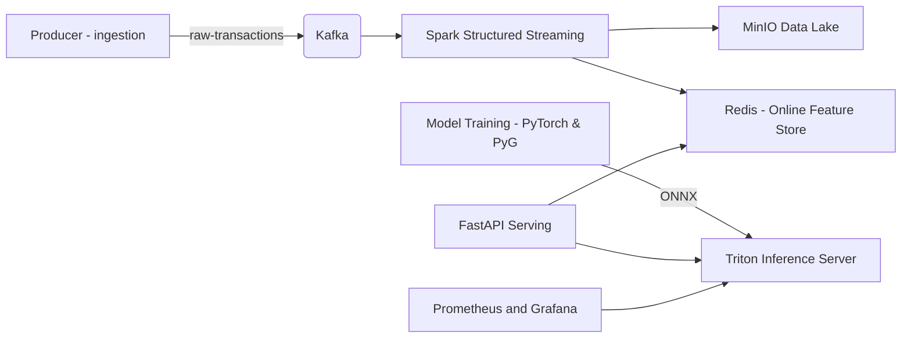

# SentinelFlow

SentinelFlow is a production-minded reference implementation of a distributed, real-time fraud detection platform. It demonstrates best-practice integrations between streaming ingestion, distributed processing, feature stores, model training, and high-performance model serving.

**Quick Links**
- Ingestion producer: [ingestion/main.py](ingestion/main.py)
- Processing pipeline: [processing/main.py](processing/main.py)
- Serving API: [serving/app.py](serving/app.py)
- Model training: [models/train.py](models/train.py)
- Deployment compose: [deploy/docker-compose.yml](deploy/docker-compose.yml)

**High-level Architecture**



## Tech Stack

- Kafka (Confluent images)
- Spark Structured Streaming (PySpark)
- Redis (feature store)
- MinIO (data lake)
- PyTorch (LSTM) and (optional) PyTorch Geometric (GNN)
- ONNX + Triton Inference Server
- FastAPI + Uvicorn for online serving
- Prometheus + Grafana for observability
- Feast (optional) for an online feature store integration
- MLflow for model registry

## Quickstart (Local)

Requirements: Docker, Docker Compose, Python 3.9+, and the repo checked out locally.

1) Start infrastructure (Kafka, Zookeeper, Redis, MinIO, Triton, Prometheus, Grafana):

```bash
cd deploy
docker-compose up -d
```

2) Start the synthetic producer to emit transactions to Kafka:

```bash
python -m ingestion.main --rate 100 --topic raw-transactions
```

3) Start the Spark Structured Streaming job (writes features to Redis and raw events to MinIO):

```bash
python -m processing.main
```

4) Train example models (toy data) and export to ONNX:

```bash
python -m models.train --out models/artifacts
python -m models.export_onnx
```

5) (Optional) Register model to MLflow and push to Triton model repository (see `models/mlflow_register.py` and `models/export_onnx.py`).

6) Run the API server:

```bash
uvicorn serving.app:app --host 0.0.0.0 --port 8080
```

7) Example prediction request:

```bash
curl -X POST -H "Content-Type: application/json" -d '{"nameOrig": "C000001"}' http://localhost:8080/predict
```

## Developer Workflow

- Linting & static types are configured via `pyproject.toml` and pre-commit hooks. Install hooks:

```bash
pip install pre-commit
pre-commit install
pre-commit run --all-files
```

- Run unit tests (GitHub Actions will also run these):

```bash
pytest -q
```

## CI / Observability

- A lint workflow runs `black`, `ruff`, and `mypy` on push/PR: [.github/workflows/lint.yml](.github/workflows/lint.yml)
- Unit tests run in [.github/workflows/integration.yml](.github/workflows/integration.yml)
- Prometheus is configured to scrape Triton metrics; rules are in [deploy/prometheus/alert_rules.yml](deploy/prometheus/alert_rules.yml)

## Advanced Enhancements Included

This repository includes scaffolding and examples for advanced production features:

- Schema evolution with Avro: [ingestion/schemas/transaction.avsc](ingestion/schemas/transaction.avsc)
- Idempotent and transactional Kafka producer support: [ingestion/kafka_producer.py](ingestion/kafka_producer.py)
- Feast integration stubs for a proper online feature store: [processing/feast_sink.py](processing/feast_sink.py), [serving/feast_store.py](serving/feast_store.py)
- Online incremental training worker: [models/online_trainer.py](models/online_trainer.py)
- MLflow model registry example: [models/mlflow_register.py](models/mlflow_register.py)
- Triton model repository + ensemble config: [deploy/model_repository/](deploy/model_repository/)
- Explainability placeholder (SHAP-like) and `/explain` endpoint: [serving/explainability.py](serving/explainability.py)
- Drift detection utility and Prometheus alert rules: [processing/drift_monitor.py](processing/drift_monitor.py), [deploy/prometheus/alert_rules.yml](deploy/prometheus/alert_rules.yml)
- Replay harness and chaos testing docs: [tests/replay_harness.py](tests/replay_harness.py), [dev/chaos/README.md](dev/chaos/README.md)
- Kubernetes Helm skeleton: [deploy/helm/](deploy/helm)
- Vault/Secrets integration guidance: [deploy/vault/README.md](deploy/vault/README.md)
- Benchmarks: [bench/locustfile.py](bench/locustfile.py) and [bench/triton_bench.py](bench/triton_bench.py)
- Labeling backend: [labeling/backend/app.py](labeling/backend/app.py)

## Pushing to GitHub

To push this repository to GitHub, add a remote and push:

```bash
git remote add origin <YOUR_REMOTE_URL>
git push -u origin main
```

If you prefer, I can prepare a script to create the GitHub repository using the `gh` CLI and push the code for you.

## Next Steps / Roadmap

- Replace placeholder modules with production integrations (Feast client, full SHAP explanations, TensorRT export).
- Harden security (TLS for Kafka/Redis, Vault secrets injection).
- Add end-to-end integration tests and CI pipelines to build and release Triton models automatically.
- Add automated deployment manifests (Helm + KEDA autoscaling) and GPU profiling for Triton.

## Contributing

Contributions are welcome. Please open issues or PRs and follow the existing commit convention used in this repository.

---

For file references see the source tree (top-level files and directories).
